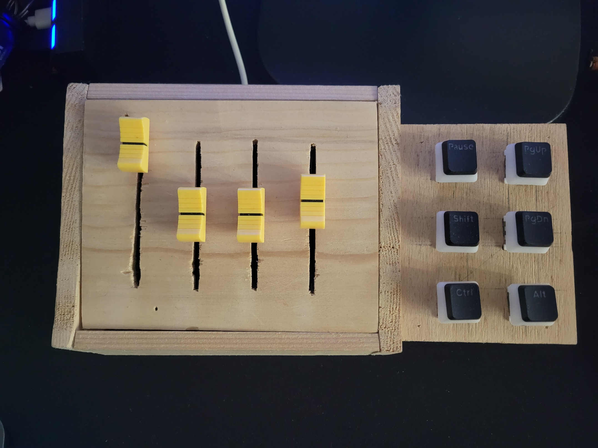
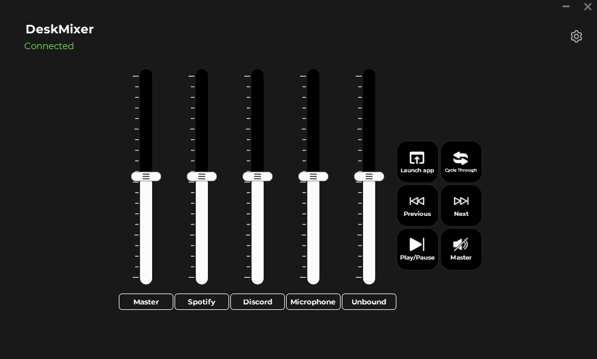
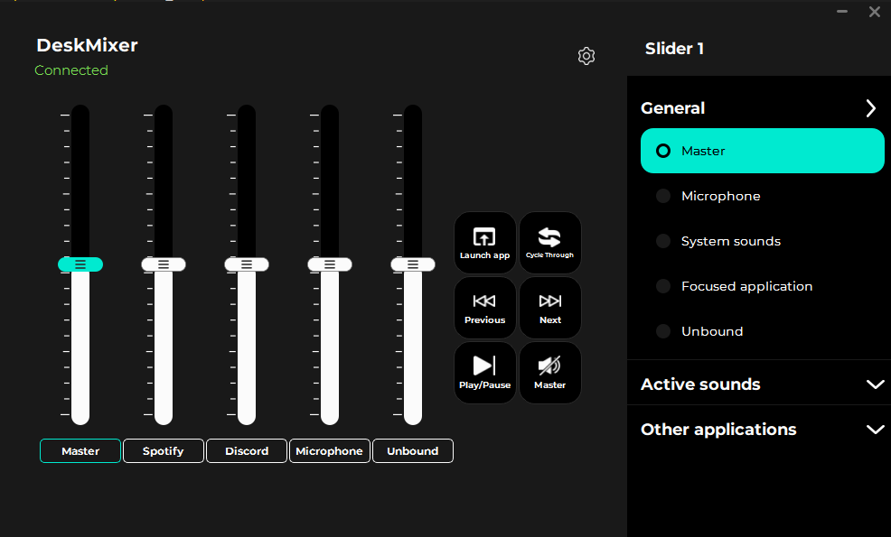
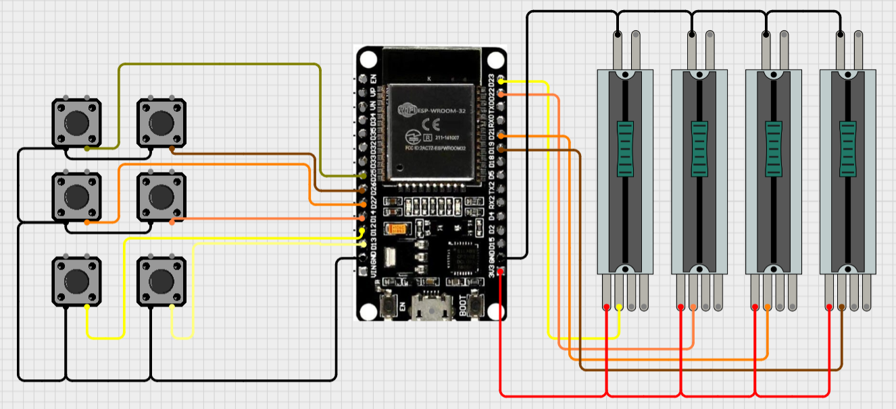

# DeskMixer 🎛️

<div align="center">

A physical volume mixer with programmable buttons for Windows, inspired by [Deej](https://github.com/omriharel/deej).

**Control your audio and automate actions with real hardware - fully scalable to your needs!**



[Features](#-features) • [Hardware](#-hardware) • [Installation](#-installation) • [Configuration](#-configuration) • [Building](#-building-from-source)

</div>

---

## 🚀 Get Started 

**For Windows users, the simplest way to get up and running is with the pre-compiled executable!**

1.  **Download:** Go to the [**Releases Page**](/RaduAndre/DeskMixer/releases) and download the latest `DeskMixer.exe` file. (no instalation needed)
2. **Configure:** Follow the steps in the [Configuration](#-configuration) section to bind your sliders and program your buttons!

---

## 📸 Gallery

### Modern Software Interface

DeskMixer features a sleek, modern interface with a dark theme and smooth animations designed for intuitive hardware control.


*Clean, modern interface with volume sliders and programmable action buttons*


*Sliding configuration menu for easy customization*

#### Interface Features

**Visual Design:**
- 🎨 **Modern Dark Theme**: Premium glassmorphic design with smooth gradients and animations
- 🪟 **Frameless Window**: Custom title bar with drag-to-move functionality
- 📐 **Scalable Layout**: Automatically adapts to any number of sliders and buttons
- ✨ **Smooth Animations**: Fluid transitions and visual feedback for all interactions

**Volume Sliders:**
- 🎛️ **Visual Scale Indicators**: Each slider displays a scale icon showing the full range
- 🏷️ **Smart Labels**: Automatically display bound applications (e.g., "Master + Spotify")
- 💚 **Hardware Sync**: Sliders animate smoothly when adjusted via hardware with green highlight feedback
- 🔄 **Drag-and-Drop Reordering**: Rearrange sliders to match your preferred layout
- 🖱️ **Click-to-Configure**: Click any slider to open its configuration menu

**Action Buttons:**
- 🎮 **Customizable Grid**: Arrange buttons in any grid size (rows × columns)
- 🔵 **Active State Indicators**: Blue highlight shows which buttons are configured
- ⚡ **Hardware Feedback**: Buttons flash when pressed on the physical device
- 🔄 **Drag-and-Drop**: Reorder buttons including empty placeholder positions
- 📝 **Dynamic Labels**: Button text adjusts to show the configured action

**Configuration Menu:**
- 📱 **Sliding Panel**: Smooth slide-in menu from the right side
- 🎯 **Context-Sensitive**: Different menus for sliders, buttons, and settings
- 🔍 **Live Search**: Browse and add applications with file picker integration
- 📋 **Expandable Sections**: Organized categories with collapsible headers
- ✅ **Visual Selection**: Active bindings highlighted with checkmarks

**Settings & Customization:**
- ⚙️ **General Settings**: Start hidden, Windows startup integration, slider sampling modes
- 📐 **Layout Controls**: Configure button grid dimensions (R×C)
- 🔄 **Reorder Modes**: Toggle swap modes for buttons or sliders independently
- 📊 **Slider Sampling**: Choose between Soft, Normal, or Hard sensitivity modes
- ℹ️ **Version Display**: Build version shown at bottom of settings menu

**Hardware Integration:**
- 🔌 **Real-time Sync**: Slider positions update instantly from hardware movements
- 🎯 **Button Press Feedback**: Visual flash confirms hardware button presses
- 🔄 **Bidirectional Control**: Changes sync between hardware and software
- 🚫 **Read-only Sliders**: UI sliders display-only to prevent conflicts with hardware control


### DIY Hardware Build

*A functional, handcrafted build - proving that professional results don't require a professional workshop!*

---

## ✨ Features

DeskMixer takes physical volume control and supercharges it with macro-like button actions.

### Volume Control
- 🎛️ **Physical Sliders**: Control individual application volumes with real hardware sliders
- 📊 **Scalable Design**: Add as many sliders as you need - the software adapts automatically
- 🔊 **Flexible Targets**: Control master volume, microphone, system sounds, or individual apps
- 💾 **Persistent Settings**: Your configuration is saved between sessions

### Button Actions
- ⌨️ **Custom Keybinds**: Map any keyboard shortcut to physical buttons
- 🎮 **Media Controls**: Play/pause, next/previous track, seek forward/backward
- 🔇 **Mute Controls**: Instant mute/unmute for system, microphone, or specific applications
- 🔀 **Audio Switching**: Switch between audio output devices with a button press
- 🚀 **App Launcher**: Launch or focus applications instantly

### System Integration
- 🪟 **System Tray**: Runs minimized with quick access
- 🔌 **Auto-Detection**: Automatic serial port detection
- 🔄 **Hot-Reload**: Configuration updates in real-time
- 🎯 **Focus Tracking**: Optional control of currently active application

---

## 🎛️ Volume Targets

The software supports multiple volume control modes:

| Target | Description | Use Case |
|--------|-------------|----------|
| 🔊 **Master** | System master volume | Overall volume control |
| 🎤 **Microphone** | Default microphone input | Quick mic adjustments |
| 🔔 **System Sounds** | Windows notification sounds | Silence those pings! |
| ⭐ **Current Application** | Currently focused app | Dynamic control of active app |
| 🎵 **Individual Apps** | Specific applications | Dedicated controls (Spotify, Discord, etc.) |
| ❔ **Unbound** | No assignment | Flexible unassigned slider |
| ❌ **None** | Disabled | Slider inactive |

**Note:** The application list updates automatically based on running audio applications. **The UI scales to accommodate any number of slider bindings you create!**

---

## 🎮 Button Actions

### Media Controls
- ⏯️ **Play/Pause**: Toggle media playback
- ⏭️ **Next Track**: Skip to next media track  
- ⏮️ **Previous Track**: Go to previous media track
- ⏩ **Seek Forward**: Jump forward in current media
- ⏪ **Seek Backward**: Jump backward in current media

### Audio Controls
- 🔊 **Volume Up**: Increase system volume
- 🔉 **Volume Down**: Decrease system volume
- 🔇 **Mute**: Toggle mute for system, microphone, or specific application
- 🔀 **Switch Audio Output**: Switch between available audio output devices*

### Advanced Actions
- ⌨️ **Custom Keybind**: Execute any keyboard shortcut (see [KEYBIND_EXAMPLES.md](KEYBIND_EXAMPLES.md))
- 🚀 **Launch App**: Start or focus specific applications

**Pro Tip:** Combine button actions with specific application targets for powerful workflows. For example:
- Mute Discord specifically with one button
- Launch Spotify and set volume to 50% with another
- Send custom shortcuts to specific apps

**The button configuration UI scales dynamically - add as many buttons as your microcontroller has pins!**

---

## 🔧 Hardware

### Required Components
- **Microcontroller**: ESP32 or compatible Arduino board
- **Sliders**: 4x 10kΩ linear potentiometers (scalable to more)
- **Buttons**: 6x push buttons (scalable to more)
- **Connection**: PCB or breadboard
- **Cable**: USB cable for serial communication

### Default Pin Configuration
You can modify these in the Arduino sketch to match your build:

**Sliders:**
- GPIO 33, 32, 35, 34

**Buttons:**
- GPIO 27, 25, 14, 26, 12, 13

### Expanding Your Build
Want more controls? Simply:
1. Add more potentiometers/buttons to your hardware
2. Update the pin configuration in `arduino/DeskMixer/DeskMixer.ino`
3. Upload the modified firmware
4. The DeskMixer software will automatically detect and configure the new inputs!

### Circuit Explanation


*Wiring diagram showing connections between ESP32, potentiometers, and buttons*

#### Understanding the Circuit

The DeskMixer circuit consists of three main components working together:

**Power Distribution:**
- The ESP32 is powered via USB connection to your computer
- All components share a common ground (GND) connection
- The 3.3V pin from the ESP32 powers the potentiometers

**Potentiometer Connections (Volume Sliders):**
Each potentiometer has three pins:
- **Left pin**: Connected to GND (ground)
- **Middle pin (wiper)**: Connected to ESP32 analog input pins (GPIO 33, 32, 35, 34)
- **Right pin**: Connected to 3.3V power

As you move the slider, the middle pin voltage varies between 0V and 3.3V, which the ESP32 reads as analog values (0-1024). The software then maps these values to volume levels (0-100%).

**Button Connections:**
Each button uses a simple pull-down configuration:
- **One side**: Connected to ESP32 digital input pins (GPIO 27, 25, 14, 26, 12, 13)
- **Other side**: Connected to GND (ground)
- **Internal pull-up resistor**: Enabled in firmware (button reads HIGH when not pressed, LOW when pressed)

**Color Coding in Diagram:**
- **Black**: Ground connections
- **Red**: 3.3V power connections
- **Yellow/Orange/Blue**: Signal wires to ESP32 GPIO pins

#### Important Notes

⚠️ **Analog Pin Limitations**: On ESP32, not all pins support analog reading. Use only ADC1 pins (GPIO 32-39) for potentiometers. Avoid GPIO 25 and 26 for analog input as they're DAC pins.

⚠️ **Voltage Levels**: ESP32 GPIO pins are 3.3V tolerant. Never connect 5V directly to any GPIO pin.

💡 **Wire Gauge**: Use 22-24 AWG wire for connections. Solid core wire works well for breadboard prototyping, while stranded wire is better for the final build.

💡 **Debouncing**: The firmware includes software debouncing for buttons to prevent false triggers. No additional hardware debouncing (capacitors) is needed.

### 3D Models & PCB Files
> **Coming Soon**: 3D printable enclosure models and Gerber files for PCB manufacturing will be added in future updates!

---

## 📦 Installation

### Option 1: Pre-built Executable (Easiest)

1. Download `DeskMixer.exe` from the [Releases](https://github.com/RaduAndre/DeskMixer/releases) page.
2. Run the executable


### Option 2: Run from Source

**Requirements:**
- Python 3.13+
- Arduino IDE
- ESP32 board or compatible Arduino

**Steps:**

1. Clone the repository:
```bash
git clone https://github.com/RaduAndre/DeskMixer.git
cd DeskMixer/src
```

2. Install dependencies:
```bash
pip install -r requirements.txt
```

3. Run the application:
```bash
python main.py
```

### Upload Firmware to Arduino

1. Open `arduino/DeskMixer/DeskMixer.ino` in Arduino IDE
2. Select your board (ESP32) and COM port
3. Upload the sketch
4. The firmware will automatically communicate with DeskMixer

---

## ⚙️ Configuration

### First-Time Setup

1. **Launch DeskMixer**
2. **Connect Hardware**: The application will automatically detect your Arduino's serial port
3. **Configure Sliders**: 
   - Click on any slider to open the configuration menu
   - Select from General options (Master, Microphone, System sounds, Focused application, Unbound)
   - Or choose from Active sounds (currently running applications)
   - Or add custom applications via the search function
   - Multiple applications can be bound to the same slider
4. **Configure Buttons**:
   - Click on any button to open the action menu
   - Select from Media Controls (Play/Pause, Next, Previous, etc.)
   - Configure Mute actions with specific targets
   - Set up custom Keybinds or Launch app actions
   - Changes save automatically

### Slider Configuration

**Binding Options:**
- **General Targets**: Master volume, Microphone, System sounds, Focused application, Unbound
- **Active Sounds**: Dynamically detected running applications with audio
- **Custom Applications**: Add any application via name search or file browser
- **Multiple Bindings**: Bind multiple applications to a single slider for grouped control
- **Smart Labels**: Slider labels automatically update to show all bound applications

**Configuration Menu:**
- Click any slider to open its dedicated configuration menu
- Expandable sections organize options by category
- Active bindings show checkmarks for easy identification
- Right-click custom applications to delete them from the list
- Browse for .exe or .lnk files to add new applications

### Button Configuration

**Available Actions:**

*Media Controls:*
- Play/Pause, Previous, Next
- Volume up/down
- Seek backward/forward

*Advanced Actions:*
- **Mute**: Choose target (Master, Microphone, System sounds, Focused application)
- **Switch Audio Output**: Cycle through devices or select specific output (Speakers, Headphones)
- **Keybind**: Enter custom keyboard shortcuts (see [KEYBIND_EXAMPLES.md](KEYBIND_EXAMPLES.md))
- **Launch app**: Browse and select applications to launch or focus

**Configuration Menu:**
- Click any button to open its action menu
- Expandable items reveal sub-options (e.g., Mute → Master/Microphone/etc.)
- Input fields for Keybind and Launch app actions
- File browser integration for selecting applications
- Active action highlighted with blue indicator

### Layout Customization

**Button Grid:**
- Open Settings menu (gear icon)
- Navigate to Layout → Grid Size
- Enter desired Rows (R) and Columns (C)
- Grid automatically validates against available buttons
- Invalid dimensions flash red with error feedback

**Reordering Elements:**
- Open Settings → Layout → Reorder Elements
- Select "Swap Buttons" or "Swap Sliders" to enter reorder mode
- Drag and drop elements to rearrange them
- Supports sparse layouts (buttons can occupy any grid position)
- Click the reorder option again to exit reorder mode

### Settings Menu

Access via the gear icon in the top-right corner:

**General:**
- **Start Hidden (on tray)**: Launch minimized to system tray
- **Start on Windows startup**: Automatically launch with Windows
- **Slider Sampling**: Adjust hardware sensitivity (Soft/Normal/Hard)

**Layout:**
- **Grid Size**: Configure button grid dimensions
- **Reorder Elements**: Enable drag-and-drop for buttons or sliders

### System Tray
- **Double-click** tray icon: Show/hide main window
- **Right-click** tray icon: Quick actions menu
- Window automatically minimizes to tray when closed

---

## 🏗️ Building from Source

Create your own executable using either method:

### PyInstaller (Faster)
```bash
cd src
python build_app.py
```

### Nuitka (More Optimized)
```bash
cd src
python build_nuitka.py
```

Built executables will appear in `src/build/dist/`

---

## 🎨 About the Hardware Build

The device shown in the gallery was handcrafted with basic tools and materials - no fancy workshop required! It's a testament that functional, effective hardware doesn't need to be professionally manufactured. The beauty of this project is in its functionality and the satisfaction of building something yourself.

**DIY Philosophy:** This project embraces the maker spirit - it's about creating tools that work for YOU, not winning beauty contests. If it controls your volume and makes your workflow better, it's perfect.

---

## 🛠️ Customization & Scalability

DeskMixer is designed to grow with your needs:

### Hardware Scaling
- **Start small**: 2 sliders and 2 buttons  
- **Go big**: 16+ sliders and 20+ buttons
- **Mix it up**: Combine sliders, buttons, rotary encoders, or other inputs

The software automatically adapts to whatever hardware configuration you define in the Arduino firmware!

### Software Flexibility
- Configure targets per-slider/button
- Create complex automation chains
- Save multiple profiles (future feature)

---

## 📝 Keybind Examples

For comprehensive keybind examples and syntax, see [KEYBIND_EXAMPLES.md](KEYBIND_EXAMPLES.md)

---

## 🤝 Contributing

Contributions are welcome! Whether it's:
- 🐛 Bug reports
- 💡 Feature suggestions  
- 📝 Documentation improvements
- 🔧 Code contributions
- 📸 Sharing your build

Feel free to open an issue or submit a pull request!

---

## 📄 License

This project is open source. Check the [LICENSE](LICENSE) file for details.

---

## 🙏 Acknowledgments

- Inspired by [Deej](https://github.com/omriharel/deej) by Omri Harel
- Built with passion for makers and tinkerers everywhere
- Special thanks to everyone who builds DIY hardware and shares their projects!

---

## 📞 Support

- **Issues**: [GitHub Issues](https://github.com/RaduAndre/DeskMixer/issues)
- **Discussions**: [GitHub Discussions](https://github.com/RaduAndre/DeskMixer/discussions)

---

<div align="center">

**Made with 🎛️ by makers, for makers**

Star ⭐ this repo if you find it useful! You can also support further development [buying me a Coffe ☕](https://ko-fi.com/andreiradu).

</div>
