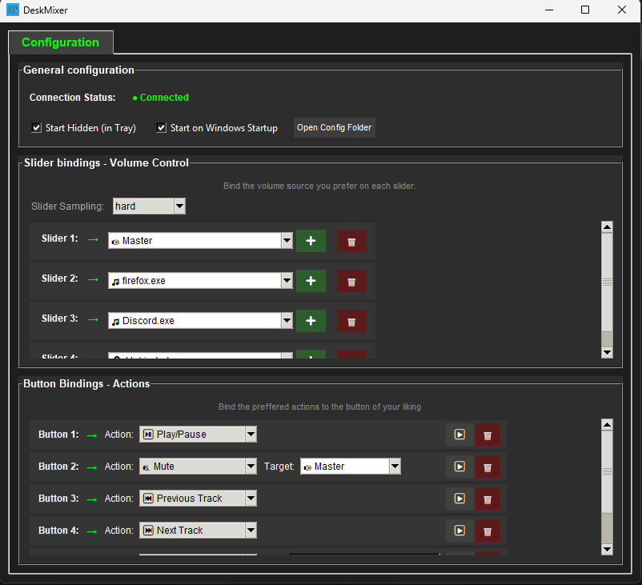

# DeskMixer 🎛️

<div align="center">

A physical volume mixer with programmable buttons for Windows, inspired by [Deej](https://github.com/omriharel/deej).

**Control your audio and automate actions with real hardware - fully scalable to your needs!**


[Features](#-features) • [Hardware](#-hardware) • [Installation](#-installation) • [Configuration](#-configuration) • [Building](#-building-from-source)

</div>

---

## 🚀 Get Started 

**For Windows users, the simplest way to get up and running is with the pre-compiled executable!**

1.  **Download:** Go to the [**Releases Page**](/RaduAndre/DeskMixer/releases) and download the latest `DeskMixer.exe` file. (no instalation needed)
2. **Configure:** Follow the steps in the [Configuration](#-configuration) section to bind your sliders and program your buttons!

---

## 📸 Gallery

### Software Interface

*The interface is fully scalable - add as many sliders and buttons as your hardware supports!*

### DIY Hardware Build

*A functional, handcrafted build - proving that professional results don't require a professional workshop!*

---

## ✨ Features

DeskMixer takes physical volume control and supercharges it with macro-like button actions.

### Volume Control
- 🎛️ **Physical Sliders**: Control individual application volumes with real hardware sliders
- 📊 **Scalable Design**: Add as many sliders as you need - the software adapts automatically
- 🔊 **Flexible Targets**: Control master volume, microphone, system sounds, or individual apps
- 💾 **Persistent Settings**: Your configuration is saved between sessions

### Button Actions
- ⌨️ **Custom Keybinds**: Map any keyboard shortcut to physical buttons
- 🎮 **Media Controls**: Play/pause, next/previous track, seek forward/backward
- 🔇 **Mute Controls**: Instant mute/unmute for system, microphone, or specific applications
- 🔀 **Audio Switching**: Switch between audio output devices with a button press
- 🚀 **App Launcher**: Launch or focus applications instantly

### System Integration
- 🪟 **System Tray**: Runs minimized with quick access
- 🔌 **Auto-Detection**: Automatic serial port detection
- 🔄 **Hot-Reload**: Configuration updates in real-time
- 🎯 **Focus Tracking**: Optional control of currently active application

---

## 🎛️ Volume Targets

The software supports multiple volume control modes:

| Target | Description | Use Case |
|--------|-------------|----------|
| 🔊 **Master** | System master volume | Overall volume control |
| 🎤 **Microphone** | Default microphone input | Quick mic adjustments |
| 🔔 **System Sounds** | Windows notification sounds | Silence those pings! |
| ⭐ **Current Application** | Currently focused app | Dynamic control of active app |
| 🎵 **Individual Apps** | Specific applications | Dedicated controls (Spotify, Discord, etc.) |
| ❔ **Unbinded** | No assignment | Flexible unassigned slider |
| ❌ **None** | Disabled | Slider inactive |

**Note:** The application list updates automatically based on running audio applications. **The UI scales to accommodate any number of slider bindings you create!**

---

## 🎮 Button Actions

### Media Controls
- ⏯️ **Play/Pause**: Toggle media playback
- ⏭️ **Next Track**: Skip to next media track  
- ⏮️ **Previous Track**: Go to previous media track
- ⏩ **Seek Forward**: Jump forward in current media
- ⏪ **Seek Backward**: Jump backward in current media

### Audio Controls
- 🔊 **Volume Up**: Increase system volume
- 🔉 **Volume Down**: Decrease system volume
- 🔇 **Mute**: Toggle mute for system, microphone, or specific application
- 🔀 **Switch Audio Output**: Switch between available audio output devices*

### Advanced Actions
- ⌨️ **Custom Keybind**: Execute any keyboard shortcut (see [KEYBIND_EXAMPLES.md](KEYBIND_EXAMPLES.md))
- 🚀 **Launch App**: Start or focus specific applications

**Pro Tip:** Combine button actions with specific application targets for powerful workflows. For example:
- Mute Discord specifically with one button
- Launch Spotify and set volume to 50% with another
- Send custom shortcuts to specific apps

**The button configuration UI scales dynamically - add as many buttons as your microcontroller has pins!**

---

## 🔧 Hardware

### Required Components
- **Microcontroller**: ESP32 or compatible Arduino board
- **Sliders**: 4x 10kΩ linear potentiometers (scalable to more)
- **Buttons**: 6x push buttons (scalable to more)
- **Connection**: PCB or breadboard
- **Cable**: USB cable for serial communication

### Default Pin Configuration
You can modify these in the Arduino sketch to match your build:

**Sliders:**
- GPIO 33, 32, 35, 34

**Buttons:**
- GPIO 27, 25, 14, 26, 12, 13

### Expanding Your Build
Want more controls? Simply:
1. Add more potentiometers/buttons to your hardware
2. Update the pin configuration in `arduino/DeskMixer/DeskMixer.ino`
3. Upload the modified firmware
4. The DeskMixer software will automatically detect and configure the new inputs!

### 3D Models & PCB Files
> **Coming Soon**: 3D printable enclosure models and Gerber files for PCB manufacturing will be added in future updates!

---

## 📦 Installation

### Option 1: Pre-built Executable (Easiest)

1. Download `DeskMixer.exe` from the [Releases](https://github.com/RaduAndre/DeskMixer/releases) page.
2. Run the executable


### Option 2: Run from Source

**Requirements:**
- Python 3.13+
- Arduino IDE
- ESP32 board or compatible Arduino

**Steps:**

1. Clone the repository:
```bash
git clone https://github.com/RaduAndre/DeskMixer.git
cd DeskMixer/src
```

2. Install dependencies:
```bash
pip install -r requirements.txt
```

3. Run the application:
```bash
python main.py
```

### Upload Firmware to Arduino

1. Open `arduino/DeskMixer/DeskMixer.ino` in Arduino IDE
2. Select your board (ESP32) and COM port
3. Upload the sketch
4. The firmware will automatically communicate with DeskMixer

---

## ⚙️ Configuration

### First-Time Setup

1. **Launch DeskMixer**
2. **Navigate to Configuration tab**
3. **Select COM Port**: Choose your Arduino's serial port from the dropdown
4. **Configure Sliders**: 
   - Click on each slider dropdown
   - Assign to Master, Microphone, System Sounds, or specific applications
   - Changes save automatically
5. **Configure Buttons**:
   - Select an action for each button
   - Set target applications if applicable
   - Test immediately - no restart needed!

### Slider Configuration
- Assign each slider to any audio source
- Multiple applications can share the same slider
- Mix and match: dedicate some sliders to specific apps, leave others flexible
- The **Current Application** target dynamically follows your active window

### Button Configuration
- Each button can have a different action
- Combine actions with targets for app-specific control
- Chain multiple shortcuts using custom keybinds

### System Tray
- **Double-click** tray icon: Show/hide main window
- **Right-click** tray icon: Quick actions menu
- **Settings**: Enable "Start Hidden (in Tray)" to launch minimized

---

## 🔧 Audio Output Switching Setup

To use the "Switch Audio Output" button action:

1. Open PowerShell as Administrator
2. Run: 
```powershell
Install-Module -Name AudioDeviceCmdlets -Force
```
3. Type 'Y' if prompted about repository trust
4. Restart DeskMixer

[More info about AudioDeviceCmdlets](https://github.com/frgnca/AudioDeviceCmdlets)

---

## 🏗️ Building from Source

Create your own executable using either method:

### PyInstaller (Faster)
```bash
cd src
python build_app.py
```

### Nuitka (More Optimized)
```bash
cd src
python build_nuitka.py
```

Built executables will appear in `src/dist/`

---

## 🎨 About the Hardware Build

The device shown in the gallery was handcrafted with basic tools and materials - no fancy workshop required! It's a testament that functional, effective hardware doesn't need to be professionally manufactured. The beauty of this project is in its functionality and the satisfaction of building something yourself.

**DIY Philosophy:** This project embraces the maker spirit - it's about creating tools that work for YOU, not winning beauty contests. If it controls your volume and makes your workflow better, it's perfect.

---

## 🛠️ Customization & Scalability

DeskMixer is designed to grow with your needs:

### Hardware Scaling
- **Start small**: 2 sliders and 2 buttons  
- **Go big**: 16+ sliders and 20+ buttons
- **Mix it up**: Combine sliders, buttons, rotary encoders, or other inputs

The software automatically adapts to whatever hardware configuration you define in the Arduino firmware!

### Software Flexibility
- Configure targets per-slider/button
- Create complex automation chains
- Save multiple profiles (future feature)

---

## 📝 Keybind Examples

For comprehensive keybind examples and syntax, see [KEYBIND_EXAMPLES.md](KEYBIND_EXAMPLES.md)

---

## 🤝 Contributing

Contributions are welcome! Whether it's:
- 🐛 Bug reports
- 💡 Feature suggestions  
- 📝 Documentation improvements
- 🔧 Code contributions
- 📸 Sharing your build

Feel free to open an issue or submit a pull request!

---

## 📄 License

This project is open source. Check the [LICENSE](LICENSE) file for details.

---

## 🙏 Acknowledgments

- Inspired by [Deej](https://github.com/omriharel/deej) by Omri Harel
- Built with passion for makers and tinkerers everywhere
- Special thanks to everyone who builds DIY hardware and shares their projects!

---

## 📞 Support

- **Issues**: [GitHub Issues](https://github.com/RaduAndre/DeskMixer/issues)
- **Discussions**: [GitHub Discussions](https://github.com/RaduAndre/DeskMixer/discussions)

---

<div align="center">

**Made with 🎛️ by makers, for makers**

Star ⭐ this repo if you find it useful! You can also support further development [buying me a Coffe ☕](https://ko-fi.com/andreiradu).

</div>